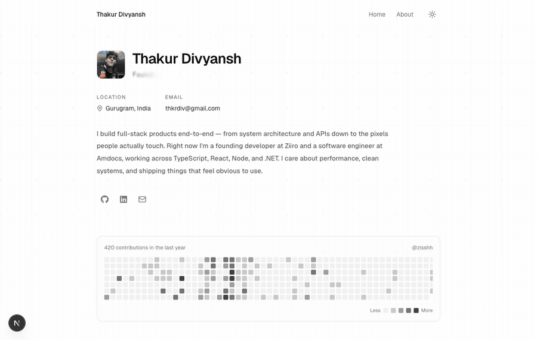

<h1 align="center">Thakur Divyansh — Founder Portfolio</h1>

<p align="center">
  <a href="https://thakurdiv.com"><strong>🔗 Live at thakurdiv.com</strong></a>
</p>

<p align="center">
  <a href="https://thakurdiv.com">
    
  </a>
</p>

A minimal, single-column founder portfolio (dark by default, with a light theme), inspired by the layout and feel of minimalism. It's the personal site of **Thakur Divyansh** — founder of [ziiro](https://ziiro.work), an AI consultancy that builds custom agentic systems for businesses.

Built with **Next.js 16 (App Router) · TypeScript · Tailwind CSS v4 · Geist fonts**.

## Features

- **Home** (`/`) — hero, GitHub contribution graph, tech-logo grid, two featured projects (a **live** [ziiro.work](https://ziiro.work) embed + a transqlate demo), experience timeline, contact form, visitor counter.
- **About** (`/about`) — story, working principles, education & community.
- **Dark / light theme** — class-based, persisted to `localStorage`, no flash on load.
- **GitHub contribution graph** — pulled live from GitHub's public contributions endpoint for [`@zisshh`](https://github.com/zisshh). No token required; revalidated hourly.
- **Contact form** — `POST /api/contact`, validated with Zod, spam honeypot + basic rate limiting, delivered via [Resend](https://resend.com).
- **Visitor counter** — `/api/visitors`, backed by Upstash Redis / Vercel KV (in-memory fallback for local dev).
- Scroll-reveal animations (respect `prefers-reduced-motion`), SEO metadata, JSON-LD, sitemap, and robots.

## Getting started

```bash
pnpm install
cp .env.example .env.local   # fill in as needed (all optional for local dev)
pnpm dev                     # http://localhost:3000
```

```bash
pnpm build && pnpm start     # production build
```

## Environment variables

All are **optional locally** — the site degrades gracefully without them (the contact
form shows a "email me directly" message; the visitor counter uses a non-persistent
in-memory value). See [`.env.example`](./.env.example).

| Variable | Purpose |
| --- | --- |
| `RESEND_API_KEY` | Enables real contact-form email delivery. |
| `CONTACT_TO_EMAIL` | Inbox that receives messages (defaults to `thkrdiv@gmail.com`). |
| `CONTACT_FROM_EMAIL` | Verified Resend sender (test sender works for sends to your own inbox). |
| `UPSTASH_REDIS_REST_URL` / `_TOKEN` | Persistent visitor counter (Vercel KV vars `KV_REST_API_URL` / `_TOKEN` also accepted). |
| `NEXT_PUBLIC_SITE_URL` | Canonical URL for metadata / sitemap / robots (defaults to `https://thakurdiv.com`). |

## Editing content

All personal content lives in [`/content`](./content) — no markup digging required:

- `profile.ts` — name, title, bio, location, socials, role rotator, quote
- `projects.ts` — featured projects
- `experience.ts` — work timeline
- `techStack.ts` — tech grid (icons resolved in `components/ui/TechIcon.tsx`)
- `about.ts` — the About page

## Deploy (Vercel)

Hosted on **[Vercel](https://vercel.com)**. To ship changes: `vercel --prod` from the project
root, or connect the repo (Project → Settings → Git) so every push auto-deploys. The custom
domain (`thakurdiv.com`) is configured via a GoDaddy `A @ → 76.76.21.21` record and a
`CNAME www → cname.vercel-dns.com` record.

> The résumé PDF is git-ignored on purpose (it contains a phone number and personal email).
> It is not served by the site.
